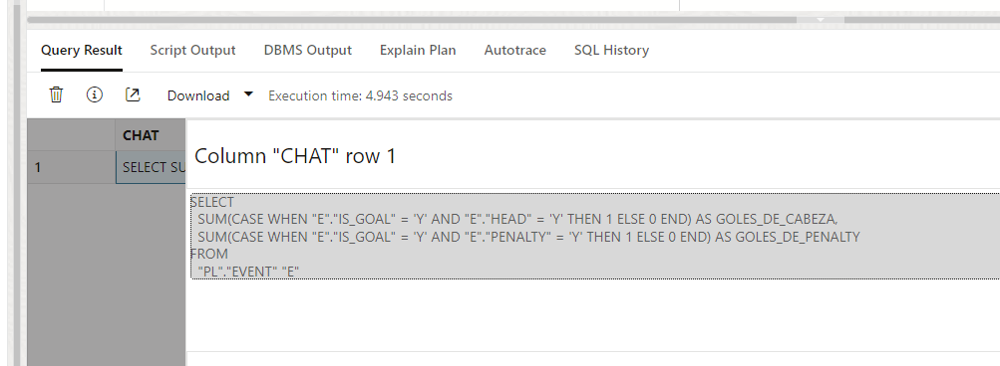

# Tutorial: Uso de Oracle Cloud Infrastructure (OCI) con servicios de IA GENERATIVA Y SELECTAI


Este tutorial te guiará a través de los pasos necesarios para trabajar con perfiles y modelos en una base de datos autónoma utilizando el SQL Web de OCI. Asegúrate de seguir cada paso cuidadosamente para completar con éxito las tareas.

## Prerrequisitos

Antes de comenzar, asegúrate de tener acceso a:
- Una **Base de Datos Autónoma** en OCI.
- Acceso al usuario `admin` <- **_IMPORTANTE_**
- El **SQL Web** habilitado `admin` para ejecutar consultas.

---

## Paso 1: Deshabilitar y habilitar el principal de recursos

Para comenzar, primero necesitamos deshabilitar y luego habilitar el **principal de recursos** para el usuario `ADMIN`. Esto nos asegurará que el entorno esté preparado para los siguientes comandos.

```sql
BEGIN
  dbms_cloud_admin.disable_resource_principal(username  => 'ADMIN');
END;
/
```

Ahora habilitamos el **resource_principal**:

```sql
BEGIN
  dbms_cloud_admin.enable_resource_principal(username  => 'ADMIN');
END;
/
```

---

# Paso 2: Crear un perfil de IA utilizando **_`Llama 3`_**

A continuación, crearemos un perfil de IA llamado `ociai_llama`. Este perfil utilizará el modelo **meta.llama-3-70b-instruct** para ejecutar tareas de inteligencia artificial sobre los datos de la base de datos.

Primero, eliminamos el perfil si ya existe:

```sql
BEGIN
    -- Elimina el perfil si ya existe
    DBMS_CLOUD_AI.drop_profile(
        profile_name => 'ociai_llama',
        force => true
    );     
END;
/
```

Luego, creamos el perfil con el modelo `meta.llama-3-70b-instruct` llamando las tablas requeridas para el lab:

```sql
BEGIN
    DBMS_CLOUD_AI.create_profile (                                              
        profile_name => 'ociai_llama',
        attributes   => 
        '{"provider": "oci",
            "credential_name": "OCI$RESOURCE_PRINCIPAL",
            "object_list": [
                {"owner": "SH", "name": "customers"},
                {"owner": "SH", "name": "sales"},
                {"owner": "SH", "name": "products"},
                {"owner": "SH", "name": "countries"}
            ],
            "model": "meta.llama-3-70b-instruct"
            }');
END;
/
```

Después de crear el perfil, necesitamos configurarlo para usarlo en nuestras consultas:

```sql
BEGIN
    DBMS_CLOUD_AI.SET_PROFILE(
        profile_name => 'ociai_llama'
    );
END;
/
```
---

# Paso 3: Generar consultas con el perfil de IA en OCI Autonomous

En este numeral, aprenderemos a utilizar el paquete `DBMS_CLOUD_AI` para generar respuestas narrativas y consultas SQL automáticas utilizando la funcionalidad de SELECT AI en Oracle Cloud Infrastructure (OCI) Autonomous Database.

## 3.1 Consulta: Obtener el jugador con más goles (respuesta narrativa)
Para obtener una respuesta narrativa:

```sql
SELECT DBMS_CLOUD_AI.GENERATE(
    prompt => '¿cual es el jugador con mas goles?',
    profile_name => 'ociai_llama',
    action => 'narrate'
) AS chat
FROM dual;
```
**Descripción**: Esta consulta genera una respuesta narrativa utilizando el perfil `ociai_llama` para responder a la pregunta sobre el jugador con más goles. El resultado será un texto descriptivo.


## 3.2 Consulta: Obtener el jugador con más goles (consulta SQL generada)

```sql
SELECT DBMS_CLOUD_AI.GENERATE(
    prompt => '¿cual es el jugador con mas goles?',
    profile_name => 'ociai_llama',
    action => 'showsql'
) AS query
FROM dual;
```

**Descripción**: A diferencia de la anterior, esta consulta genera una instrucción SQL que puede ser utilizada para obtener el jugador con más goles, en lugar de una respuesta narrativa.

## 3.3 Consulta: Visualizar eventos en la tabla PL.EVENT

Es posible crear texto LLM usando la interfaz de Oracle SQL.

```sql
SELECT * FROM pl.event;
```
**Descripción**: Esta consulta recupera todos los registros de la tabla PL.EVENT, que contiene información sobre eventos de partidos, incluyendo goles, tipo de gol (cabeza, penalti, etc.).

### 3.3.1 Consulta: Análisis de goles de cabeza y goles de penalti (respuesta narrativa)

**Descripción**: Esta consulta utiliza SELECT AI para proporcionar una respuesta narrativa sobre la cantidad de goles de cabeza y de penalti registrados en la tabla PL.EVENT.

```sql
SELECT DBMS_CLOUD_AI.GENERATE(
    prompt => '¿La tabla PL.EVENT contiene información sobre la cantidad de goles, donde están marcados como Y / N dependiendo de cómo se anotaron. La columna HEAD indica si el gol fue de cabeza. ¿Cuántos goles de cabeza se han realizado?,¿Cuántos goles de PENALTY se han realizado?, Responde en español',
    profile_name => 'ociai_llama',
    action => 'narrate'
) AS chat
FROM dual;
```

---

---


# Reto Final: Uso de showsql para Consultas Automatizadas

En esta sección final del tutorial, los participantes deberán usar la función showsql para generar y visualizar la consulta SQL que responde a una pregunta específica sobre los datos en la tabla **PL.EVENT**.

## Instrucciones del Reto:

**Objetivo**: Usar la función **DBMS_CLOUD_AI.GENERATE** con la acción `showsql` para que el sistema genere automáticamente una consulta SQL que obtenga la cantidad de goles de cabeza y de penalti.

Consulta base a Utilizar:

```sql
SELECT DBMS_CLOUD_AI.GENERATE(
    prompt => '¿La tabla PL.EVENT contiene información sobre la cantidad de goles, donde están marcados como Y / N dependiendo de cómo se anotaron. La columna HEAD indica si el gol fue de cabeza. ¿Cuántos goles de cabeza se han realizado?,¿Cuántos goles de PENALTY se han realizado?, Responde en español',
    profile_name => 'ociai_llama',
    action => 'narrate'
) AS chat
FROM dual;
```
## El resultado deber ser algo similar a:



# FIN

---

## ¡Gracias por seguir este tutorial!

Espero que este tutorial te haya sido útil y te permita sacar el máximo provecho de las capacidades de Oracle Cloud Infrastructure en tus proyectos. Si tienes alguna duda o sugerencia, no dudes en contactarme. Estoy siempre dispuesto a apoyar en el proceso de transformación digital y adopción de tecnologías innovadoras.

**[Jorge Alexander Galán Méndez](https://www.linkedin.com/in/jorge-alexander-galan-mendez/)**  
**Ingeniero Electrónico especializado en Gerencia Empresarial**  
**Maestría en Inteligencia Artificial**  

¡Éxito en tu camino hacia la innovación tecnológica!

---


